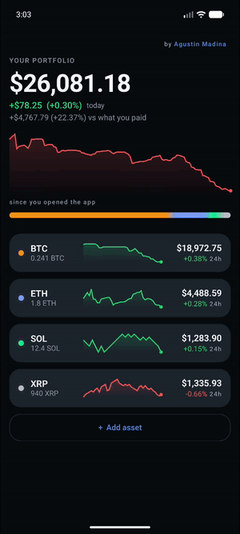
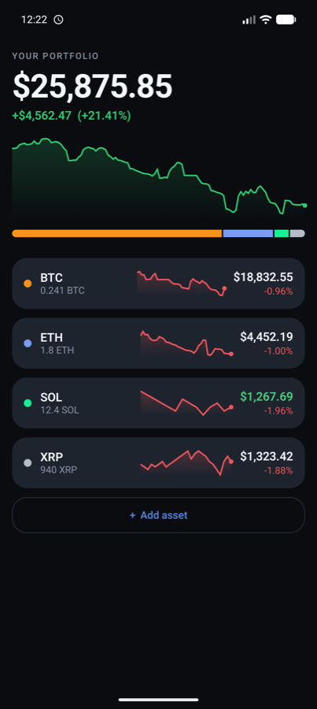
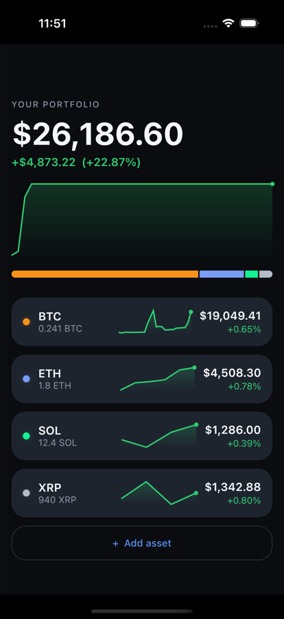
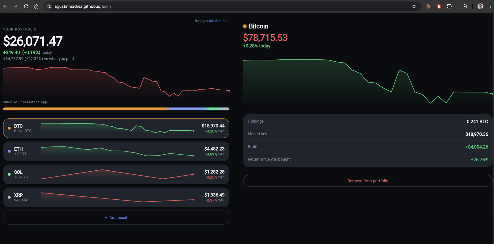
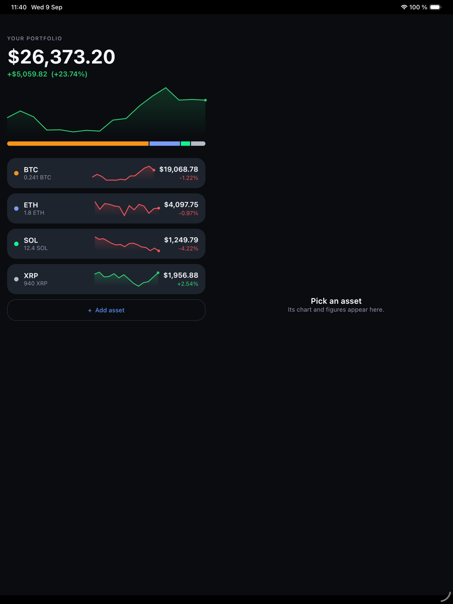
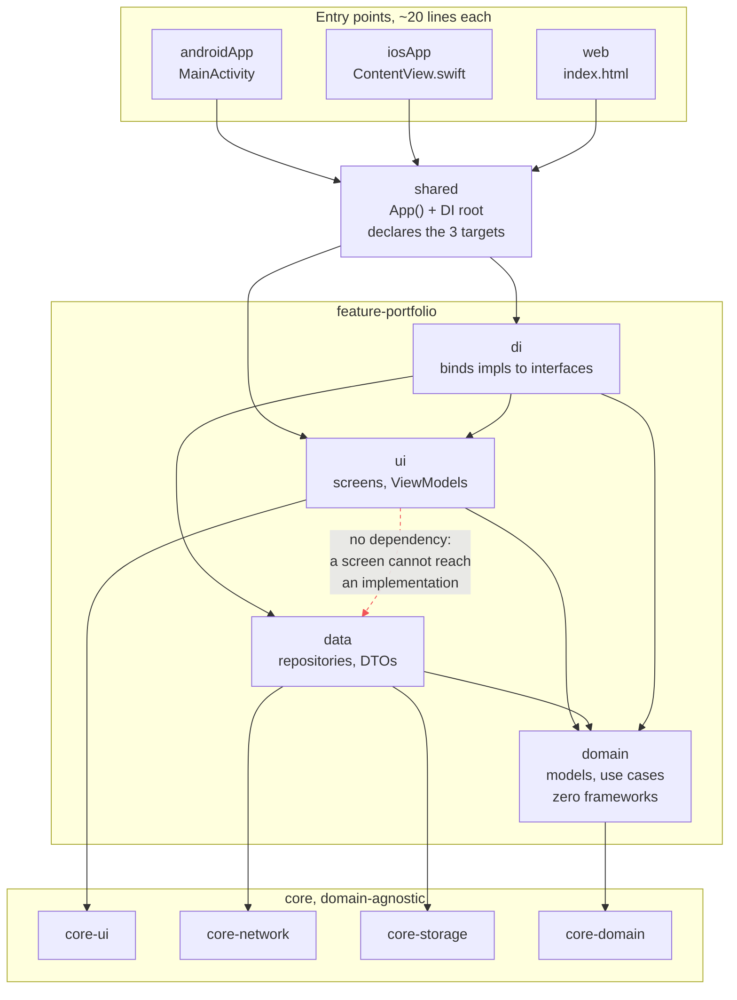

# Tickr

**One Kotlin codebase. Android, iOS and the web. Including the entire UI.**

[](https://github.com/agustinmadina/tickr/actions/workflows/ci.yml)
[](https://agustinmadina.github.io/tickr/)


### ▶ [Open the live web app](https://agustinmadina.github.io/tickr/)

No install, no sign up. What you see in the browser is not a port or a rewrite: it is the same
Compose UI that runs on the phones, compiled to WebAssembly. Prices are live, streamed from
Coinbase over a WebSocket.

<p align="center">
  
</p>

<p align="center">
  <em>Prices ticking in, dragging along the chart to read any moment in the session, opening a
  position, and searching the live Coinbase catalogue. Nothing here is a mockup: every number
  arrives over a WebSocket while the recording runs.</em>
</p>

### The same screen, built from the same code

<p align="center">
  
  &nbsp;
  
</p>

<p align="center">
  <em>Android and iOS, captured at the same second. Not a shared design system rendered twice: one
  implementation, two runtimes. The totals differ by cents because these are two independent live
  connections, not one screenshot pasted twice.</em>
</p>

<p align="center">
  
</p>

<p align="center">
  <em>And the same screens in a browser, at the address in the bar. Not a port and not a web
  rewrite: that is Kotlin compiled to WebAssembly, drawing the same Compose UI.</em>
</p>

<p align="center">
  
</p>

<p align="center">
  <em>The same app on an iPad. Given a wide enough screen, a tablet or a maximised browser window,
  the list and the detail sit side by side instead of one covering the other. It is the same code
  and the same state deciding, so there is no separate tablet layout to keep in sync.</em>
</p>

---

## What is actually shared

Most Kotlin Multiplatform projects share a data layer and write the screens three times. This one
shares everything, so there is exactly one implementation of each screen, each animation and each
piece of business logic.

| | Android | iOS | Web |
|---|---|---|---|
| Business logic and networking | shared | shared | shared |
| **Screens, charts and animations** | **shared** | **shared** | **shared** |
| Platform-specific code | `MainActivity` | `ContentView.swift` | `index.html` |

Those last three are launchers. Each one is under twenty lines and does nothing but host the same
`App()` composable.

**Desktop is one line away.** Compose Multiplatform also targets JVM desktop, and the architecture
needs no change for it: add the target and a Ktor engine, and the same UI runs there. It is left
out because the demo is meant to be opened, not downloaded.

## Architecture

Clean architecture, with the boundaries enforced by the **build system** rather than by
convention. A screen cannot reach into the data layer even by accident, because `ui` does not
declare a dependency on `data`, so the violation fails to compile instead of being caught in review.

```
core/
  core-common      dispatchers, no business concepts
  core-domain      UseCase and FlowUseCase base classes
  core-network     one Ktor client, engine chosen per platform
  core-ui          theme, design tokens, BaseViewModel, shared components
features/
  feature-portfolio/
    domain         models, repository interfaces, use cases. Pure Kotlin, zero frameworks
    data           repository implementations, DTOs, mappers
    ui             Compose screens, ViewModels, UI models
    di             the only module that sees all three, and binds them together
shared/            declares the three targets, hosts App() and the DI root
build-logic/       convention plugins, so the target list is declared once
```



The dashed line is the one that matters: `ui` does not declare a dependency on `data`, so reaching
past the domain interfaces is a compile error rather than a review comment.

A few decisions worth the click if you are reviewing this technically:

- **`domain` has no framework dependencies at all.** No Koin, no Ktor, no Compose, no platform
  types. It is plain Kotlin and coroutines, which is what makes it testable without a single mock
  framework.
- **Merging streams happens in a use case, never in a ViewModel.** The portfolio is holdings and
  prices combined; doing that in the ViewModel is how ViewModels grow until nobody can say where a
  value came from. The ViewModel observes one pre-merged stream.
- **Navigation is state, not a library.** The destination lives in the ViewModel, which is what
  lets the same state drive a stacked layout on a phone and a two pane layout on a tablet or a wide
  browser window, without a second navigation graph.
- **Implementations are `internal`.** Each layer exposes a Koin module and nothing else, so the
  boundaries hold at the language level too.

## The API layer, both halves of it

| | Endpoint | Why |
|---|---|---|
| **WebSocket** | `wss://ws-feed.exchange.coinbase.com` | Live prices, pushed. No polling, so no rate limit to manage |
| **REST** | `api.exchange.coinbase.com/products`, `/currencies` | The catalogue of assets you can actually add |

Both are public: no API key, no account, nothing to hide in a secret. That is deliberate, and it is
what makes the web build possible at all, since a browser has no server to keep a key behind. Web
sockets are also exempt from CORS preflight, so the browser connects to the exchange directly.

You can only add assets the exchange actually quotes, chosen from the catalogue. Typing a symbol by
hand would let you add something that never receives a price and sits blank for ever.

## Stack

| Concern | Choice |
|---|---|
| UI | Compose Multiplatform, Material 3 |
| Async | Coroutines and Flow |
| Networking | Ktor client (OkHttp on Android, Darwin on iOS, browser fetch on web) |
| Serialization | kotlinx.serialization |
| DI | Koin, constructor injection |
| Tests | Kotest, BehaviorSpec |
| Build | Gradle convention plugins, version catalog |

Kotlin 2.4.10, AGP 9.2.1, Compose Multiplatform 1.11.1, Gradle 9.6.1.

## How the three targets are kept honest

The interesting problems in this project are the ones you only meet when the UI is shared too:

- **One `expect`/`actual` for the HTTP engine.** Ktor has no engine covering all three platforms,
  so that is the seam. Everything above it, including the WebSocket handling, is shared.
- **No `Dispatchers.IO` anywhere.** It is JVM only and does not compile for iOS or wasm. Same for
  `synchronized`, replaced by a coroutines `Mutex`.
- **Fonts are not a given.** The back arrow started as the character `←`, which Android and iOS
  render from the system font and the web build draws as an empty box, because Skia bundles its
  own. It is drawn with Canvas now.
- **One pointer abstraction for finger and mouse.** The chart is scrubbable with a finger on a
  phone and with a hovering cursor in a browser, from a single component.
- **CI compiles all three.** Linux covers Android and web, and a macOS job links the iOS framework,
  so "runs everywhere" is checked by the pipeline rather than asserted here.

## Quality gates

Every push runs formatting, tests and the three builds:

```shell
./gradlew ktlintCheck        # formatting, fails the build
./gradlew testAndroidHostTest # Kotest specs
```

**67 specs**, covering the parts where being wrong is expensive and invisible: money arithmetic
with an unpriced holding, a zero cost basis, recovering yesterday's price from a percentage,
resubscribing the feed when holdings change, persistence surviving a restart, and search ranking.

Several of them exist because a defect got through first and the spec was written to keep it out.

## Built with an AI workflow, deliberately

This repository is also a demonstration of working with AI coding agents in a way that holds up,
rather than accepting whatever they produce. The setup lives in [`.claude/`](.claude/):

- **34 architecture and code-quality rules** that load themselves. Each rule declares the file
  globs it governs, so an agent editing a ViewModel gets the ViewModel rules in context
  automatically, and a reviewer reads all of them. They are the reason the boundaries above are
  consistent rather than aspirational.
- **[`CLAUDE.md`](CLAUDE.md)** is what makes those rules binding, plus the non-obvious constraints
  that cost time to rediscover.
- **16 specialised agents and 11 skills** for planning, implementing, reviewing and shipping,
  including a review agent that reads the full rule set against a diff.
- **Rules were pruned, not copied.** Seven that described infrastructure this project does not have
  were deleted and several more retargeted, because a rule describing a structure you do not have is
  worse than no rule: one demanded a `desktopMain` actual for every `expect` and never mentioned
  wasm, which is the target the project exists for.
- **The agents were run against the whole codebase, not just a diff.** That pass is where the
  pruning above came from, along with a chart animation that had never run, a loading state the app
  could not leave when the feed was unreachable, and a spec that named the behaviour it was checking
  and did not check it. Each fix was confirmed by breaking the code again and watching the test go
  red.
- **Verification is visual and recorded.** Screens are checked by running them and reading the
  screenshot, not by trusting that they compile. Several real defects in this repo were found that
  way and only that way, including a chart that measured zero pixels tall.

## Who built this

**Agustin Madina**, Android and Kotlin Multiplatform engineer. Ten years shipping mobile, from
solo-founder MVPs to apps with fifty engineers and millions of users.

Products for **Disney**, **NewsCorp**, **WWE**, **MarketWatch** and **Deloitte**. The last five
years in wallets, payments and decentralized identity: multi-chain transaction signing for Bitcoin,
XRP and Solana, debit card and ACH flows, and a refactor of a production wallet from RxJava to
Coroutines and from views to Compose without pausing delivery.

I wanted a piece that argues for KMP the way I would in a conversation: not with a shared networking
layer and three sets of screens, but with one implementation of everything, running where you can
click it. The decisions I would defend in a review are written down next to the code that makes
them, including the ones where I chose the less impressive option on purpose.

- [LinkedIn](https://www.linkedin.com/in/agustin-madina/)
- [github.com/agustinmadina](https://github.com/agustinmadina)
- agustinmadina@gmail.com
- The app itself has an **About** sheet with the same summary and links, reachable from the header

## Running it

```shell
./gradlew :androidApp:installDebug             # Android
./gradlew :shared:wasmJsBrowserDevelopmentRun  # web, on localhost
open iosApp/iosApp.xcodeproj                   # iOS, then run from Xcode
```

## Status

The portfolio persists across restarts on all three platforms, so what you add stays added.

**Not SQLDelight**, which has no maintained wasm driver, and the web target is the point here. A
portfolio is a handful of rows read and written whole, so a serialised document in each platform's
own store is proportionate: SharedPreferences, NSUserDefaults, localStorage, behind one
`expect`/`actual`.
